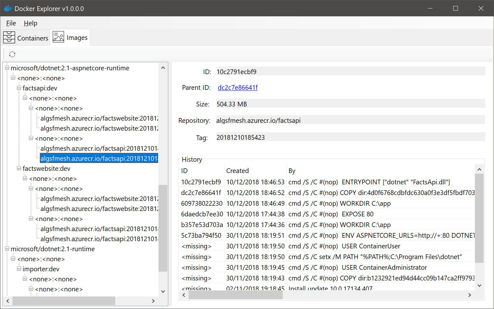

# Docker Explorer for Windows

## Why

I wanted a fast, native Windows applicaton to explore lock Docker Desktop content. This is a Windows Forms application (old tech, but reliable and extremely fast).

## Status

Working version, features are implemented on demand.

## Features

- Browse containers, including logs, labels, mounts and ports
- Browse images in hierarchy view, including image history

## Installing

The latest version can be installed [from here](http://i.isolineltd.com/dockerexplorer/Setup.exe). The updates are installed automatically via [Squirrel.Windows](https://github.com/Squirrel/Squirrel.Windows).

