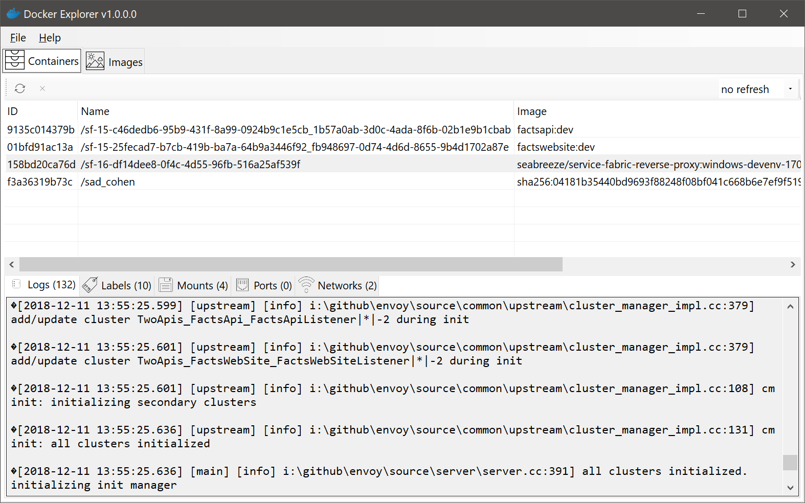
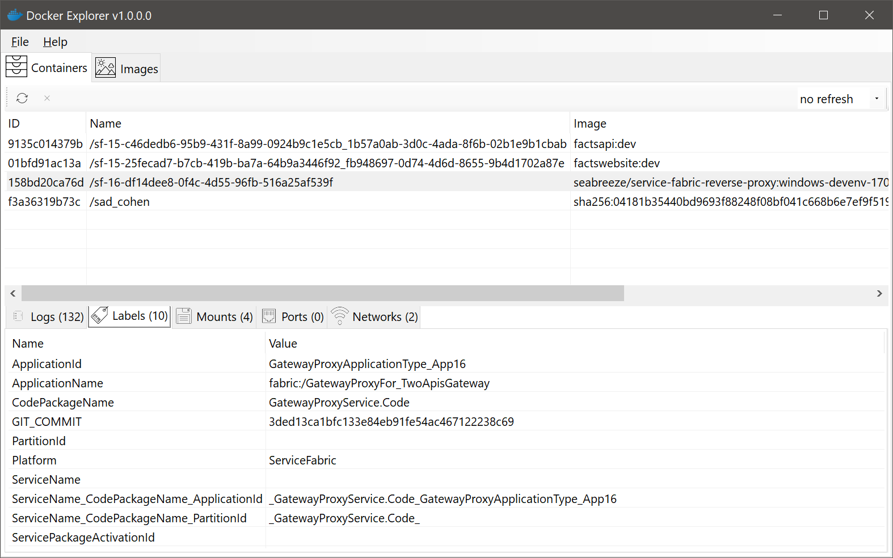
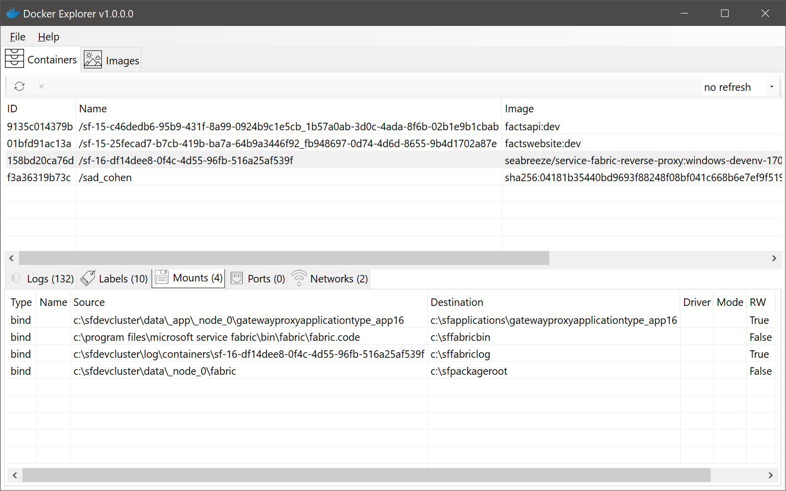
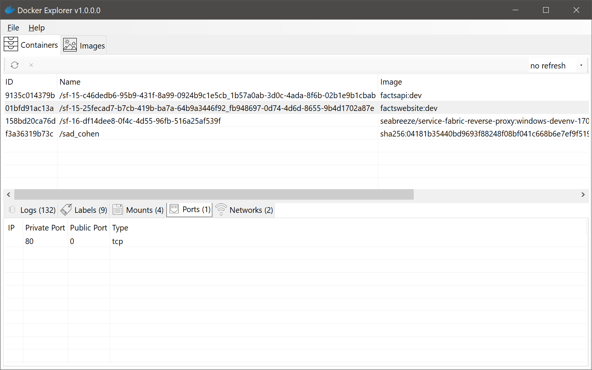
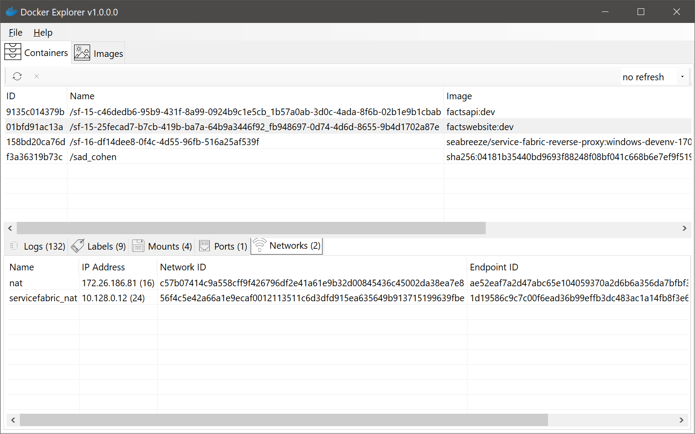

## It's blazing fast

I wanted a fast, native Windows applicaton to explore lock Docker content during my development sessions. Docker console is great, but sometimes it's taking too much time to find what I need, therefore this tool.

### Why not Electron?

Because Electron runs 5 web servers to show a simple UI window and dramatically slows down an average PC. In my personal opinion, Electron is a productivity killer (what's the point of waiting for UI if I can do it in the terminal so much faster). Native UI in this tool is blazing fast.

## Status

Completely working and useful version. You can install the latest version by pressing the button below:

## Features

Browse images in tree view, see basic container information and history

Browse contianers, and explore logs, labels, mounts, ports and networks

The updates are installed automatically via [Squirrel.Windows](https://github.com/Squirrel/Squirrel.Windows).

